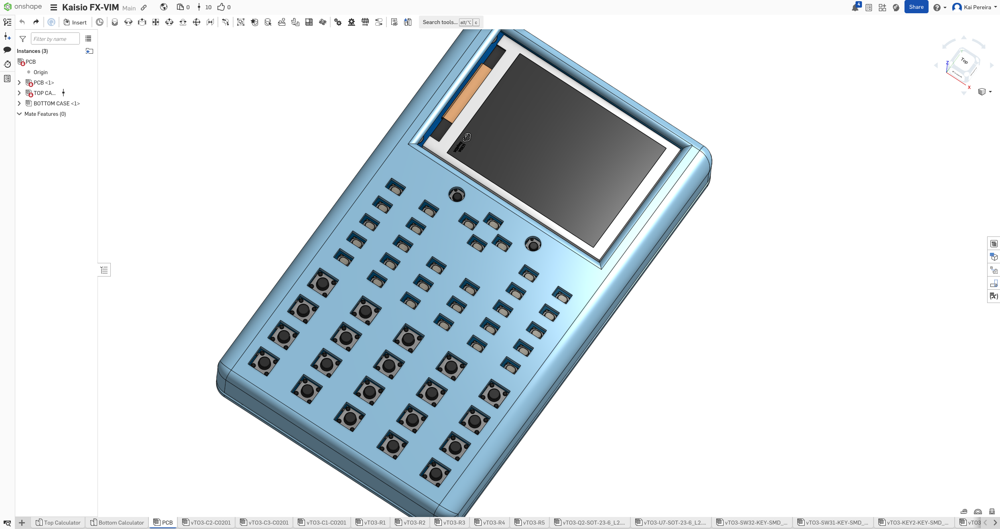
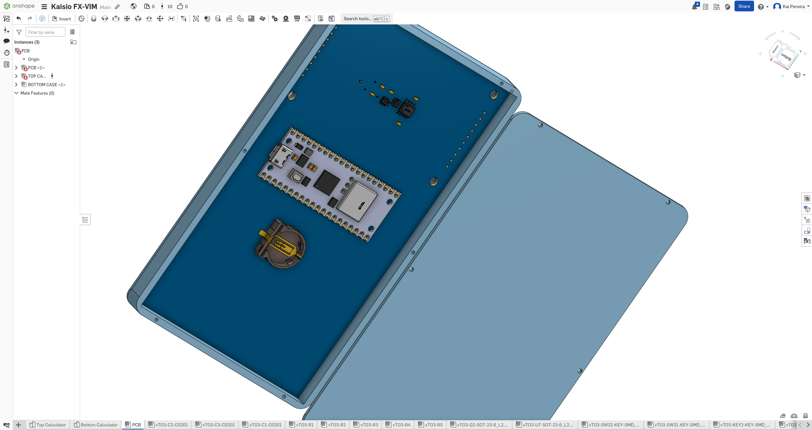
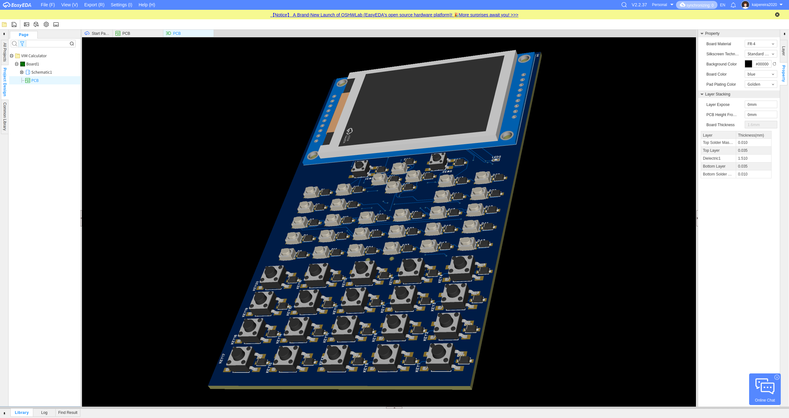
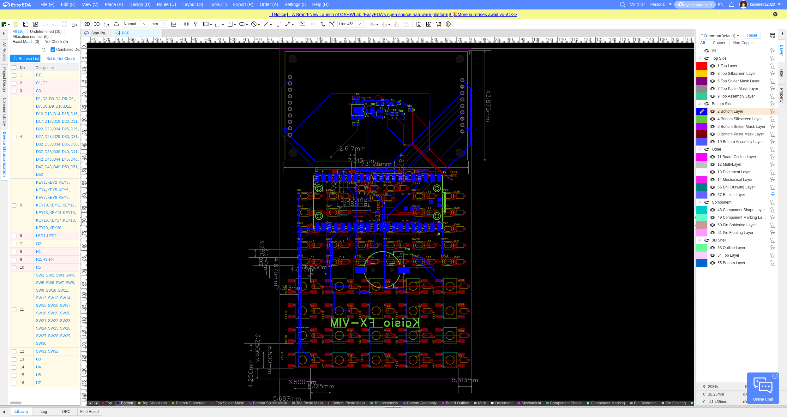
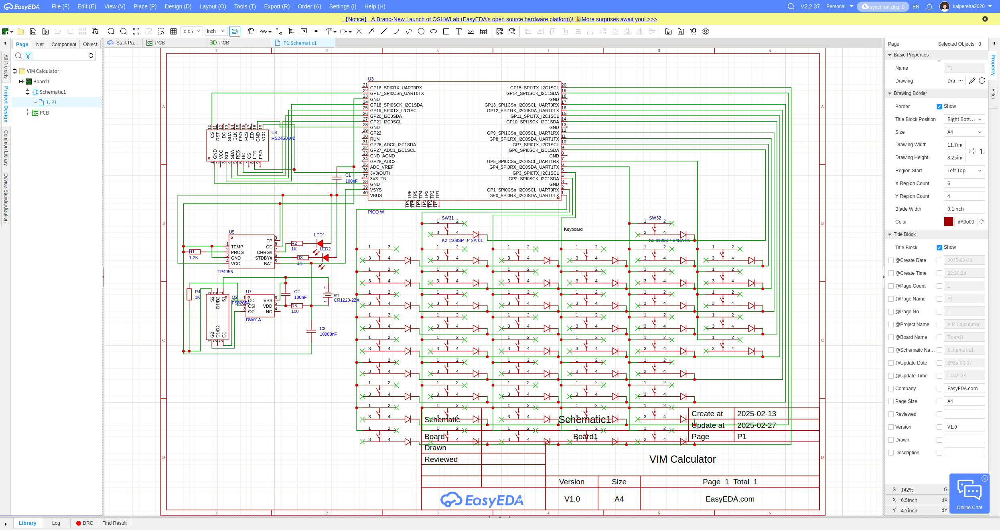

# About
The **Kaisio FX-VIM** is a scientific graphing calculator with VIM programming capabilities and wireless connection.

It's discrete calculator design makes it look like you're just using a normal calculator while actually programming.

It also has quick mode switching from **calculator -> desmos -> vim -> browser**, battery charging and mouse support (in the form of an external device or the arrow keys :3)

# Specifications

The Kaisio FX-VIM uses a:
- 2.4 320x240 LCD Screen
- Large keyboard matrix with many button types
- Battery charging with a LiPo Holder
- Pico W microcontroller
- Battery protection circuit

# Why I made it
I made this calculator because I've always found all my classes extremely boring and I'd just end up programming on paper and making random schematics. So I thought if I could just make a discrete device to just do what I was doing before, it would be really cool.

I feel like alot of other people feel this way too, and because all the files are open sources people can for sure print this out for themselves.

# Plans
It's just about ready to be printed and sent to me and once I have it, I plan on making a fun video for it and shipping it to every platform imaginable!
